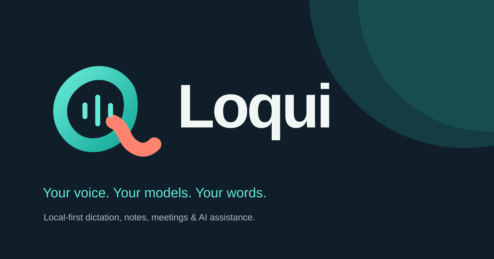

<p align="center"></p>

# Loqui

A local-first voice workspace for dictation, notes, meetings, and assistant conversations. Run speech recognition on your computer, use your own provider API keys, or connect a ChatGPT subscription through Codex for text tasks. Choose speech recognition and text processing independently.

**Pre-release software.** The first planned version is `0.1.0-beta.1`. Public release, signing, and hardware acceptance checks are still pending; see the [verification record](docs/VERIFICATION.md). The instructions below do not imply that a signed installer is already available.

## What you can do

- Dictate into Loqui, then set up a shortcut and optional paste into other applications.
- Use local Whisper or sherpa-onnx speech models, including Orukeet and NVIDIA Parakeet choices.
- Keep the original transcript or add optional cleanup using a local model, ChatGPT through Codex, or an API provider.
- Write notes, record meetings, review transcription history, and search a local workspace.
- Import compatible GGUF text models and manage downloads in the application.

Loqui does not require an account or provide a hosted backend, cloud backup, synchronization, teams, or billing. Local inference works offline after the selected models are downloaded. Features that use a remote provider, URL import, or calendar connection need a network connection.

## Platforms and installation

| Platform            | Release target      | Requirements                                                                           |
| ------------------- | ------------------- | -------------------------------------------------------------------------------------- |
| Apple Silicon macOS | DMG and ZIP         | macOS 14.2 or newer; microphone permission, and Accessibility for automatic paste      |
| Linux x86_64        | AppImage and tar.gz | A graphical desktop; shortcut, paste, and meeting audio support depends on the session |

Windows and Intel Mac releases are outside this release series. The platform list describes build targets, not a guarantee that every microphone or desktop environment has been validated.

Reviewed installers, when published, will appear only on [Loqui Releases](https://github.com/snowopsdev/loqui/releases). Check the release's known issues and checksums before installing. macOS public releases must be Developer ID signed and notarized; development packages are not public releases. Linux AppImages need executable permission. The tarball is a portable alternative with manual updates. See [troubleshooting](TROUBLESHOOTING.md) for permissions and Linux integration.

Until a reviewed release is available, [build from source](docs/DEVELOPMENT.md).

## Your first dictation

1. Choose your spoken languages and a local speech model in setup. Downloads start only when requested.
2. Choose optional text cleanup. The suggested lightweight local option is Qwen3.5 2B; **No cleanup** is also a complete dictation setup.
3. Record a short sample inside Loqui. Setup shows what is ready and lets you explore the workspace while unfinished items remain available later.
4. Optionally configure the shortcut and automatic paste for other applications.

For **ChatGPT subscription access**, install a Codex CLI version supported by this build: **0.154.x, 0.155.x, or 0.156.x**. Select **ChatGPT subscription (Codex)** during cleanup setup or **Codex (ChatGPT)** in Language Models, connect your account, and select an available model. Loqui uses the official `codex app-server` with a separate sign-in profile; an existing CLI login is not imported. Codex serves text tasks, including cleanup, translation, chat, note formatting, and meeting summaries. It does not provide audio transcription or embeddings. Account limits and model availability still apply.

API providers use your own credentials and billing. A failed cleanup request preserves the original transcript; Loqui does not silently switch to another provider. See [privacy and network behavior](docs/PRIVACY.md) before connecting remote services.

## Data and updates

Your workspace is stored on this device. On a fresh profile, local transcription history is enabled, transcripts have no automatic expiry, and retained audio expires after 30 days. Change these preferences during setup or in **Privacy & Data**. Local storage does not mean the database and recordings are encrypted by Loqui.

Automatic update checks and downloads are enabled by default after setup and can be disabled in **System** settings. Installation requires an explicit restart. The update system targets this repository; signed Mac apps and AppImages are the automatic-install targets, while tarball installations use a download link. Signed update acceptance is still pending.

Loqui starts with an isolated `io.github.snowopsdev.loqui` profile. Development data is separate, while beta and stable releases share the production profile. No OpenWhispr or Whispr Personal data migration is included. See [storage and credentials](docs/PRIVACY.md#storage-and-credentials) for the exact boundaries.

## Development and contributions

The application uses Electron, React, TypeScript, and SQLite. Use the exact Node patch in [.node-version](.node-version) and the committed lockfile. A UI preview needs no provider account or desktop permissions:

```sh
npm ci --ignore-scripts
npm run dev:renderer
```

Open `http://127.0.0.1:5183/`. Browser previews use sample data and simulated services; desktop recording requires Electron. See [development and packaging](docs/DEVELOPMENT.md), [onboarding preview controls](docs/ONBOARDING_PREVIEW.md), and the [contribution guide](.github/CONTRIBUTING.md).

Bug reports and focused pull requests are welcome. Read the [support guide](SUPPORT.md), [code of conduct](CODE_OF_CONDUCT.md), and [security policy](SECURITY.md). Maintainers should also read the [public-repository checklist](docs/PUBLICATION.md) and [release procedure](docs/RELEASING.md).

## License and attribution

Loqui is an independent fork of [OpenWhispr](https://github.com/OpenWhispr/openwhispr), originally based on upstream commit `6d56d75e7e13ec47009e573e9ff4cded0d0ccc61`. The public history is sanitized to remove restricted artwork; original historical commit IDs may therefore differ. Upstream authorship and MIT attribution are retained.

Application source and original Loqui artwork are [MIT licensed](LICENSE). Dependencies, bundled runtimes, fonts, and model weights retain their own licenses; see [third-party notices](THIRD_PARTY_NOTICES.md) and the [runtime asset manifest](runtime-assets.json). Loqui is not affiliated with OpenWhispr, OpenAI, or the other providers it supports.
